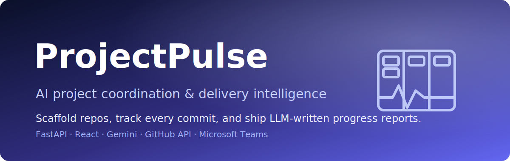

<p align="center">
  
</p>

<h1 align="center">ProjectPulse</h1>

<p align="center"><em>AI project coordination — scaffold the repo, track every commit, and ship LLM-written progress reports.</em></p>

<p align="center">
  
  
  
  
  
</p>

**ProjectPulse** is an AI project-coordination platform for teams that spin up many repos and need to stay on top of delivery. It uses **Google Gemini** to scaffold a runnable project skeleton, **PyGithub** to create the GitHub repo, add collaborators and wire up webhooks, then watches incoming commits to track contributor activity and generate executive-style progress reports — optionally pushed to **Microsoft Teams**. The backend is **FastAPI + SQLAlchemy + SQLite**; the dashboard is **React + Vite**.

> From "create a project" to "here's the delivery report" — the busywork of coordinating engineering work, automated.

---

## ✨ Features

- 🤖 **AI project scaffolding** — Gemini (`gemini-2.0-flash`) generates a minimal runnable project skeleton (directory structure + file contents) from a name, type, and free-form requirements.
- 🔗 **GitHub automation** — creates the repository, adds assignees as collaborators, and pushes the generated files via the GitHub API.
- 📊 **Commit & contributor tracking** — a webhook endpoint ingests push events and tallies per-author commit counts in the database.
- 📝 **Progress reports** — Gemini reads the repo README plus commit history and writes a progress summary (full and concise variants), including suggested next steps and last-commit impact analysis.
- 🔎 **Repository analyzer** — point it at any GitHub URL (`/api/progress/analyze`) to pull the commit log, contributor stats, and an AI summary on demand.
- 💬 **Teams notifications** — optionally sends project-creation and summary updates to a Microsoft Teams channel via incoming webhook.

## 🏗️ Architecture

```
┌──────────────────────┐
│   Frontend (React +  │
│   Vite, port 3000)   │
└───────────┬──────────┘
            │ HTTP / axios  (proxy /api -> :8000)
            ▼
┌─────────────────────────────────────────────┐
│            FastAPI backend (:8000)           │
│  ┌───────────────────────────────────────┐  │
│  │  /api/projects   /api/github-webhook   │  │
│  │  /api/.../summary   /api/progress/*    │  │
│  └───────┬───────────────────────────────┘  │
│          │                                   │
│   ┌──────▼──────┬──────────┬──────────────┐  │
│   │ LLM service │  GitHub   │    Teams     │  │
│   │  (Gemini)   │ (PyGithub)│  (webhooks)  │  │
│   └──────┬──────┴──────────┴──────────────┘  │
│          │                                   │
│   ┌──────▼───────────────────────────────┐  │
│   │  SQLAlchemy ORM  ->  SQLite database  │  │
│   │  projects · contributions · summaries │  │
│   └───────────────────────────────────────┘  │
└─────────────────────────────────────────────┘
```

## 🚀 Run it

**Prerequisites:** Python 3.9+, Node.js 18+, a [GitHub Personal Access Token](https://github.com/settings/tokens) (`repo`, `admin:repo_hook`), and a [Google Gemini API key](https://makersuite.google.com/app/apikey).

### Backend

```bash
cd backend
python -m venv venv
source venv/bin/activate          # Windows: venv\Scripts\activate
pip install -r requirements.txt
python main.py                    # serves http://localhost:8000
```

Interactive API docs are available at `http://localhost:8000/docs`.

### Frontend

```bash
cd frontend
npm install
npm run dev                       # serves http://localhost:3000
```

## 🔧 Configuration

Create a `.env` file in `backend/` with your credentials:

```env
GITHUB_TOKEN=ghp_your_token_here
GEMINI_API_KEY=your_gemini_key_here
WEBHOOK_URL=https://your-server.com/api/github-webhook
```

The frontend can optionally set `VITE_API_URL`; by default Vite proxies `/api` to `http://localhost:8000`.

For local webhook testing, expose the backend with ngrok and use the resulting URL:

```bash
ngrok http 8000
# WEBHOOK_URL=https://xxxx.ngrok.io/api/github-webhook
```

## 📦 API surface

| Method | Path | Purpose |
| --- | --- | --- |
| `POST` | `/api/projects` | Scaffold + create a new project repo |
| `GET`  | `/api/projects` | List tracked projects |
| `POST` | `/api/github-webhook` | Ingest push events, tally contributions |
| `GET`  | `/api/projects/{id}/summary` | Latest stored progress summary |
| `POST` | `/api/projects/{id}/generate-summary` | Generate a fresh AI summary (optional Teams push) |
| `POST` | `/api/progress/analyze` | Analyze any GitHub repo URL on demand |
| `GET`  | `/api/progress/health` | Health check for the analyzer |

## 🗃️ Data model

- **projects** — `id`, `name`, `type`, `repo_url`, `requirements`, `created_at`
- **contributions** — per-author `commit_count` per project
- **summaries** — AI-generated `summary_text` with timestamp

## 🧪 Tests

Backend tests live in `backend/tests/` (webhook handling, progress analyzer, progress-service units):

```bash
cd backend
pytest
```
